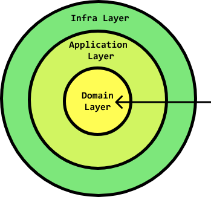

<h1 style="text-align: center; font-size: 3rem" align="center">Domain Driven Design on FastAPI</h1>
<h6 style="text-align: center; font-size: 1.4rem; margin-bottom: 30px;" align="center">AtlanticaConf 2023 - UDC - Workshop</h6>
<div align="center" style="display: flex; gap: 5rem; align-items: center; justify-content: space-around; margin-top: 1rem">
  
  
  
</div>
<h6 style="text-align: center; font-size: 2rem" align="center">by Python Coruña</h6>

## Introduction :writing_hand:

Welcome dear coder to the official repository for the tech talk series called **"FastAPI from Zero to Hero"**.

My name is **Roberto García** and I really hope you can enjoy these resources to keep growing in your career path as a
python programmer specifically developing **REST APIs** using **FastAPI** as a framework.

We are in the second phase called **"Domain Driven Design on FastAPI"**, now we should do our first steps together towards a event driven architecture, apply our
previous knowledge about all the good things that **FastAPI** provide us out-of-box, take the steering wheel of our
business logic in our projects and build resilient and agnostic code despite the libraries or specific technologies of
persistence, messaging, cache, identifiers, time and so on.

___

## Requirements :bullettrain_side:

* Python >= 3.8
* docker
* Starving for knowledge (The most important :smile:)
___
## Getting started :checkered_flag:

```bash
# Clone the repository
git clone https://github.com/soulcodex/fastapi-ddd-atlantica-workshop.git shoes-store-api

# Setup the repository
cd shoes-store-api
make shoes-api
make shoes-api-bash
```
___
## Available commands :running: :fire:

* Run the `make help` command to get a list of all available commands

```text
shoes-api                      Setup shoes api dependencies.
shoes-api-bash                 Open a new bash terminal inside shoes-api container.
shoes-api-docker-stop          Down docker containers related with the shoes service.
shoes-api-package-add          Add package to our shoes api deps.
shoes-api-package-remove       Remove package from our shoes api deps.
shoes-api-unit-test            Run unitary tests suite for shoes application.
shoes-api-acceptance-test      Run acceptance tests suite for shoes application.
```
___

## Project folders structure :file_folder:

```text
.
├── apps
│   └── shoes
│       ├── dependency_injection
│       ├── docker
│       ├── migrations
│       ├── routes
│       └── ui
├── shared
│   ├── domain
│   │   ├── bus
│   │   └── types
│   └── infrastructure
│       ├── mysql
│       └── pytest
├── shoes
│   ├── application
│   ├── domain
│   └── infrastructure
│       ├── persistence
│       └── pytest
└── tests
    └── shoes
```

### apps :open_file_folder: :arrow_double_down:

* Basically is the folder to define all the entrypoints for those applications which live in this repository
  following a monorepo structure.
* Defines dependency injection graph and bootstrap it all of them.
* Framework entrypoints and all the most external things which needs pieces which comes from the framework (routers,
  middlewares, pydantic models, etc...)
* Docker :whale: things (development or deployment things related with Docker)
* Database migration files on each bounded context folders.

### shoes == module == bounded context :open_file_folder: :shoe:

* application :open_file_folder: :arrow_up: :arrow_down:
    * Application use cases, interaction between the domain and infrastructure driven by the query and command bus.
        * For 1 query exist one query handler and the same for commands (query -> read operations, command -> write
          operations).
        * Application services which supports the query and command handlers (Rarely needed but that's the correct
          place).
        * Unitary tests which validates the handler's logic.
* domain :open_file_folder: :european_castle:
    * In this layer we should put all the related with data model definition which match with the real world
      representation, in this case the root model is `Shoe`.
    * Domain services implementations or ports interfaces (no implementations just definitions AKA abstract method
      classes).
    * Value objects which help us to validate the integrity of the data in a bidirectional way (api -> database or
      database -> api).
* infrastructure :open_file_folder: :mag: :office:
    * Database connections (database pool, single reader, reader and writer).
    * Cache adapters (Redis, Elastic cache, Key value database etc..).
    * Repositories implementations (MySQL, MS SQL Server, PostgreSQL, Elasticsearch, Redis, MongoDB, etc...).
    * Messaging system connection and publishers (SNS, SQS, RabbitMQ, Kafka, Red Panda, etc...).
    * Identifiers generation (UUID and ULID generator library implementation).
    * Time providers (Provider which generate new instances of objects in charge to handle the time.).
    * and so on.

### shared :open_file_folder: :twisted_rightwards_arrows:

* domain :open_file_folder: :european_castle:
    * Shared logic of domain definitions and ports (Query bus, Command bus, Value objects parents).
    * Domain errors base definitions and severities.
* infrastructure :open_file_folder: :mag: :office:
    * Shared logic to implement infrastructure components
        * Base repositories implementations or infrastructure interfaces.
        * Database connection pools and helpers.
        * Providers (time, identifiers and so on).
        * Test library shared implementations across all bounded contexts.
        * Shared middlewares or something specific to use with the framework.
        * Pydantic base implementations and models.

### tests :open_file_folder: :gem:

* Acceptance tests (HTTP calls, E2E, validate input and output with all the actors)
    * Typology of test in charge to validate how our components works together validating if the code / app do the
      expected behavior or not.